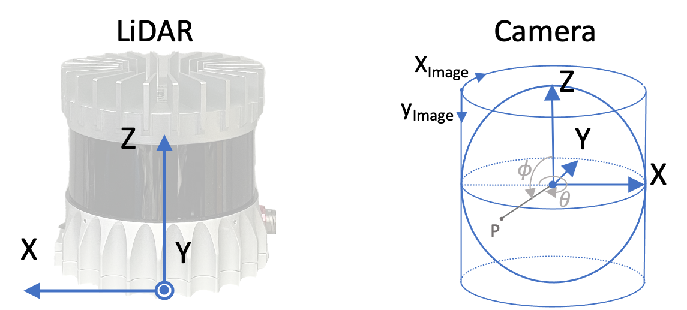

# INF: Implicit Neural Fusion for LiDAR and Camera
[Project Page](https://shuyizhou495.github.io/inf-project-page/) | [Video](https://youtu.be/I1MJ_tUdNB4) | [Paper](http://arxiv.org/abs/2308.14414) | [Data](#data)

## Dependencies
You need to first install CUDA and the correspoinding PyTorch following [PyTorch documentation](https://pytorch.org/get-started/locally/).

We used cuda 11.7 and PyTorch 2.0.0 in our experiments.
## Installation
The necessaray libraries are in [requirements.txt](requirements.txt). Note that PyTorch is not included in requirements.txt. you need to install PyTorch by yourself in advance.
Install requirements.txt by
```shell
python3 -m pip install -r requirements.txt
```

## Data
**Data is only for academic use.** [Agree and download here](https://www.cvl.iis.u-tokyo.ac.jp/~zhoushuyi495/dataset/inf_data.zip). 

Structure:   
Images are saved in images folder, while LiDAR scans are saved in scans folder.
```
├───data/
│   ├───indoor1/
│   │   ├───images/
│   │   ├───scans/
│   │   ├───camera_mask.png
│   │   ├───ref_ext.json
│   │   ├───poses.npy
│   │   └───lidar_mask.png
│   └───indoor2/
│       ├───images/
│       └───scans/
```

1. Put the data under [data](./data) folder. You can use the following code:
   ```bash
   mv inf_data.zip <your_working_directory>/data/inf_data.zip
   cd <your_working_directory>/data
   unzip inf_data.zip
   rm inf_data.zip
   ```

2. The file names of images and LiDAR scans are in order.
The file name of nth camera image is hard coded as `f"{id:04}.jpg"` in [data/base.py](data/base.py#L165). The file name of the nth LiDAR scan is hard coded as `f"{id:04}.npy"` in [data/ouster](data/ouster.py#L70).
1. Other files that are not mandatory:
   1. **poses.npy**: known poses of LiDAR scans with shape of (-1, 3, 4) or (-1, 4, 4). **Required** if you want to evaluate the estimated poses or train the neural density field with known poses. The way to read the pose file is defined in [data/base.py](data/base.py#L253)
   2. **ref_ext.json**: the reference LiDAR-camera extrinsic parameters. **Required** if you want to evaluate estimated extrinsic parameters. The way to read json file is defined in [model/color.py](model/color.py#L253). Note this is the extrinsic parameters to project LiDAR points to camera space. Inside json it should be like
      ```json
      "rotation": [-1.0405687 , -3.93209467,  5.79554194],
      "translation": [-0.004058155231177807, -0.02666468918323517, -0.19954881072044373]
      ```
   3. **lidar_mask.png**: mask for LiDAR scans. **Required** if you want to mask some areas of the LIDAR frames. The projection should be consistent to LiDAR projection functions. The way to read mask in defined in [data/base.py](data/base.py#L232).
   4. **camera_mask.png**: mask for camera scans. **Required** if you want to mask some areas of the camera frames. The way to read mask in defined in [data/base.py](data/base.py#L119).

## Execution
In our project, the process of density field training and camera-LiDAR calibration are separated.

Option files are saved in [options/](options/). Detail explanations for the options are written in base options in [options/bases](options/bases).

Note that `yaml` and `model` attributes must be specified in command lines.

### Density Field
To train density field with estimating poses:
```shell
python3 main.py --model=density  --yaml=density_poses_indoor1
```
To train density field with known poses:
```shell
python3 main.py --model=density  --yaml=density_known_indoor1
```

### Color Field
**You need to specify the `name` used for density field training in `density_name` tag.**
```shell
python3 main.py --model=color --yaml=color_indoor1 --density_name=density
```
### Results
Results will be in `output/{group}/{name}`

### Options
The options are explained in the option files in [options/bases/](options/bases/). 
- [base.yaml](options/bases/base.yaml) includes the options common in both density field and color field trainings. 
- [base_density.yaml](options/bases/base_density.yaml) includes the options required for training density field with known LiDAR poses.
- [base_density_poses.yaml](options/bases/base_density_poses.yaml) includes the options required for training density field and LiDAR poses.
- [base_color.yaml](options/bases/base_color.yaml) includes the options required for training color field and LiDAR-camera extrinsic parameters.
  
Additionally, we emphasize the following options here.
1. Range of scene(**Required for training Density Field**). It is used to normalize the points for positional encoding. You need to provide a rough range of the scene so that the points in the scene can be normalized to (0, 1).
   ```
   --train.range=60
   ```
2. The threshold distance of movements for a local map(**Required for LiDAR pose estimation**). If a frame is certain distance away from the most recent keyframe, we consider this frame as keyframe. This distance is defined in:
   ```
   --train.distance=2
   ```
3. Maximum depth for rendered depth map(**Required in all cases**). The depths rendered will be mapped to color map ranging from 0 to this maximum depth.
   ```
   --render.depth=30
   ```
4. Initial value for extrinsic parameters for faster convergence(**Optionaly for LiDAR-camera calibration**). This should be the LiDAR-to-camera transformation. The first three number should be the rotation represented with xyz-order euler angles in degrees. The last three number should be the translation in xyz order in meters.
   ```
   --extrinsic=[0,0,0,0,0,0]
   ```
   The coordinate used in our program is shown as this:  
   


## Citation
```bibtex
@inproceedings{zhou2023inf,
    author    = {Shuyi, Zhou and Shuxiang, Xie and Ryoichi, Ishikawa and Ken, Sakurada and Masaki, Onishi and Takeshi, Oishi},
    title     = {INF: Implicit Neural Fusion for LiDAR and Camera},
    journal   = {IROS},
    year      = {2023}
    }
```

## Acknowledgements
The code is accessible under the BSD license and based on codes from BARF, which is governed by the MIT license. The projection function of panorama camera follows that in LiDAR and Camera Calibration using Motion Estimated by Sensor Fusion Odometry under MIT license. You can locate the licenses within the [licenses/](licenses) directory.